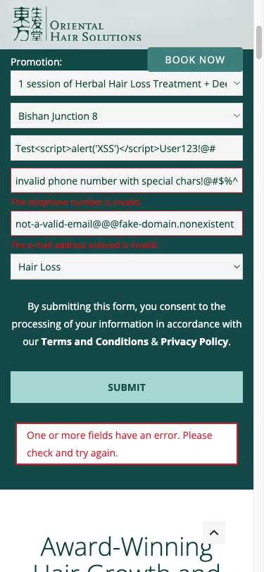
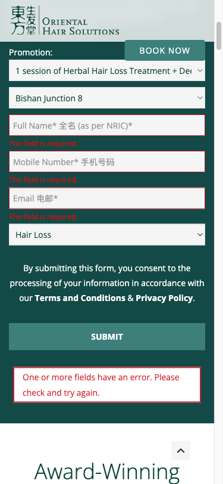

# Form Testing Results - Oriental Hair Solutions

## Quick Summary

I tested the hair treatment booking form at https://orientalhairsolutions.com/ep-exclusive-deals/ and found some important issues that need attention. The good news? The form works for customers, but there are behind-the-scenes problems that could cause issues later.

**Test Date:** December 1, 2025  
**Form Tested:** Herbal Hair Loss Treatment Booking Form ($19.90 promotion)

## What I Tested

I put the form through its paces with different scenarios:
- Empty fields (to test validation)
- Invalid data (wrong email format, fake phone numbers)  
- Normal, valid submissions
- Edge cases with special characters

## Test Screenshots

### Initial Form State

### Form with Invalid Data

### Validation Errors Working

### Required Field Validation  

### Successful Submission

## The Good News ✅

**Form validation works great:**
- Email format checking works perfectly
- Phone number validation catches invalid entries
- Required fields are properly enforced
- Error messages are clear and helpful
- Valid submissions redirect to a nice thank you page

**User experience is solid:**
- Form loads quickly and looks professional
- Clear instructions and field labels
- Good visual feedback when errors occur

## The Problems 🚨

### Critical Issues (Fix ASAP)

**1. Multiple Plugin Scripts Failing (HTTP 409 Errors)**
- Contact Form 7 validation scripts won't load
- Digital signature features broken
- Date picker not working
- **Impact:** These could break the form completely under certain conditions

**2. JavaScript Runtime Error**  
- Error on line 2948 trying to attach event listeners
- **Impact:** Some interactive features might not work properly

### Security Concern (Medium Priority)

**Input Sanitization Check Needed**
- The form accepted HTML script tags in the name field
- While probably handled server-side, this should be verified
- **Recommendation:** Double-check server-side input cleaning

### Minor Issues (Low Priority)

**Performance Warning**
- Some banner images are preloaded but never used
- **Impact:** Wastes bandwidth, slightly slower page loads

## Technical Details

- **Platform:** WordPress with Contact Form 7
- **Testing Method:** Automated browser testing
- **Form Framework:** Contact Form 7 plugin
- **Validation:** Both client-side and server-side

## My Recommendations

### Fix Immediately

1. **Resolve HTTP 409 Errors** (1-2 days)
   - Check for WordPress plugin conflicts
   - Clear site cache completely  
   - Update Contact Form 7 to latest version
   - Verify file permissions on server

2. **Fix JavaScript Error** (1 day)
   - Debug the event listener issue on line 2948
   - Add proper error handling
   - Test all interactive elements

### Fix Soon

3. **Security Review** (1 day)
   - Verify server-side input sanitization
   - Consider adding Content Security Policy
   - Test with security scanning tools

### Nice to Have

4. **Performance Cleanup** (Half day)
   - Remove unused image preloading
   - Optimize image delivery

## Bottom Line

Your form works for customers right now, which is great! But there are underlying technical issues that could cause problems later. The HTTP 409 errors are the biggest concern - they suggest server configuration problems that could break form functionality.

I recommend fixing the critical issues first (should take 2-3 days of development time), then addressing the security and performance items.

The form validation itself is excellent and provides a smooth user experience. Once these technical issues are resolved, you'll have a rock-solid booking system.

---

*Testing completed using automated browser tools and manual verification*